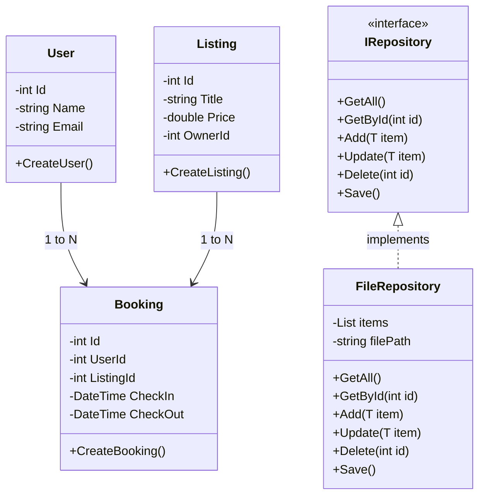

# Class Diagram

```mermaid
classDiagram
    class User {
        -int Id
        -string Name
        -string Email
        +CreateUser()
    }
    class Listing {
        -int Id
        -string Title
        -double Price
        -int OwnerId
        +CreateListing()
    }
    class Booking {
        -int Id
        -int UserId
        -int ListingId
        -DateTime CheckIn
        -DateTime CheckOut
        +CreateBooking()
    }
    class IRepository {
        <<interface>>
        +GetAll()
        +GetById(int id)
        +Add(T item)
        +Update(T item)
        +Delete(int id)
        +Save()
    }
    class FileRepository {
        -List items
        -string filePath
        +GetAll()
        +GetById(int id)
        +Add(T item)
        +Update(T item)
        +Delete(int id)
        +Save()
    }

    IRepository <|.. FileRepository : implements
    User --> Booking : 1 to N
    Listing --> Booking : 1 to N
```